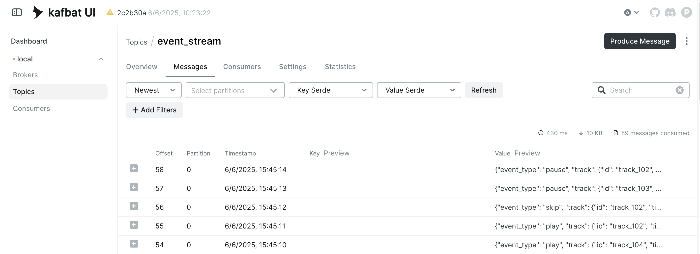

# Streaming Data Pipeline

- kafka
- kafka-ui

Run with Docker on localhost:
```
docker compose up --build -d
```
Once the services are started, messaged published to Kafka Topics can be viewed in Kafka UI App at http://localhost:8080


To shut down the services and remove containers:
```
docker compose down -v
```